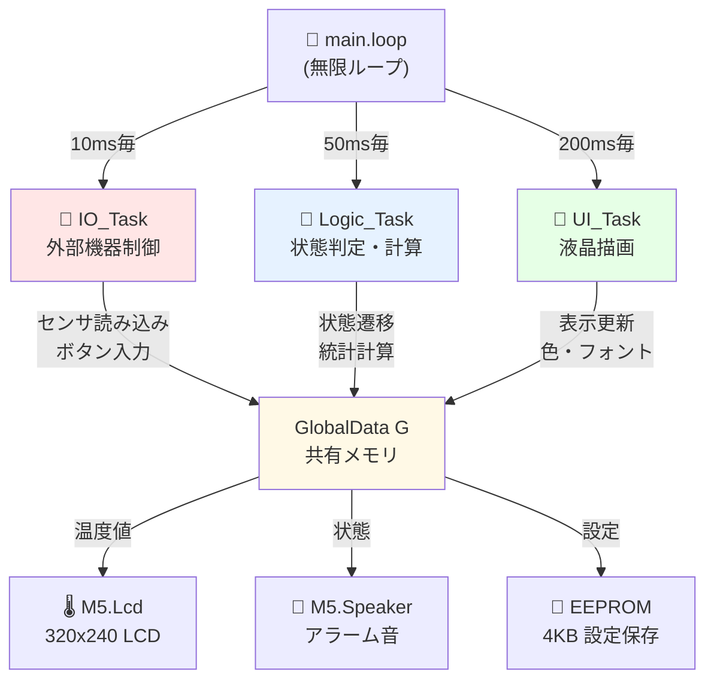
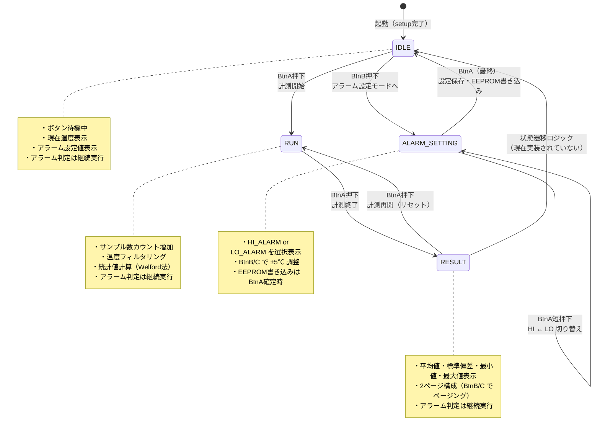
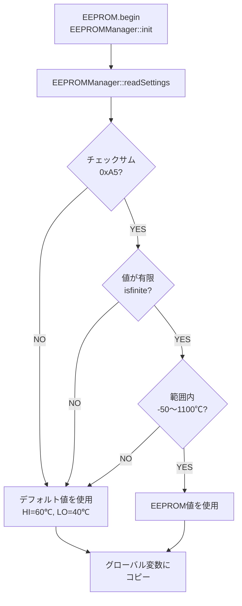
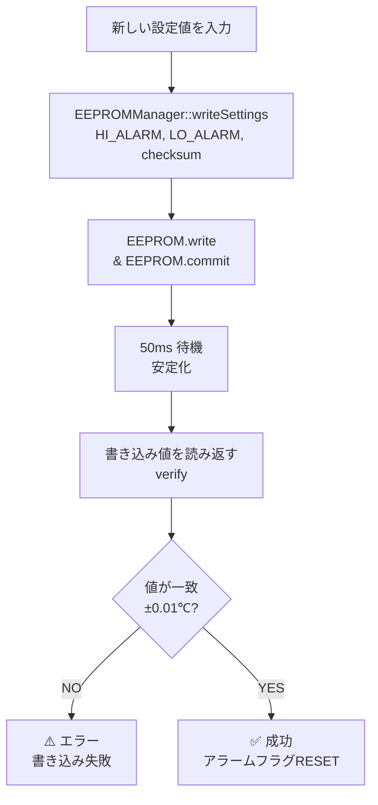

# 温度評価ツール コード完全解説書

> **"Simple can be harder than complex."**
> 
> このドキュメントは、M5Stack温度評価ツールのコード（`main.cpp` / `Tasks.cpp` / `Global.h`）を、「単なる文字の羅列」ではなく**「生きている仕組み」**として理解するためのガイドです。
> プログラミング言語の文法よりも、**「なぜそう設計されているのか？」**というエンジニアの思考プロセスに焦点を当てています。

**最終更新**: 2026年2月26日

---

## 1. 整理整頓の極意

### 📂 バインダー：`struct`（構造体）
GX Works3などでいう**「グローバルラベル」**や**「構造体データ」**に非常に近い概念です。

もし、変数をバラバラに作っていたら、コードのあちこちにデータが散らばって管理不能になります。そこで、**「このプロジェクトの共通データは、全部このバインダー（G）に綴じる！」**と決めるのが `struct` です。

```cpp
struct {
  float  D_RawPV;       // センサ生値
  float  D_FilteredPV;  // フィルタ後の値
  double D_Sum;         // 合計
  long   D_Count;       // 回数
} G; // このバインダーを「G（Global）」と名付ける
```

取り出すときは必ず **`G.`** をつけて呼び出します（例：`G.D_Sum`）。これによって、「あ、これはお弁当箱（G）の中の具材（変数）なんだな」と一目でわかります。

---

## 2. 登場人物（変数と型）

プログラムの世界には、様々なサイズの「箱」が登場します。中に入れるものに合わせて、適切な箱を選ぶのが第一歩です。

### 🌡️ 温度を入れる箱 (`float`, `double`)

温度は `25.5` のように小数点が必要です。

- **`float` (フロート)**: 一般的な小数を入れる箱。
  - 用途: `D_RawPV` (センサから読んだ瞬間の値)
- **`double` (ダブル)**: `float` の2倍の精度と大きさを持つ巨大な箱。
  - 用途: `D_Sum` (積算値)
  - **Why?**: 足し算を1万回繰り返すと、小さな箱(`float`)では桁が溢れたり、誤差が積もって数字が正確でなくなります。だからここだけは、贅沢に巨大な箱を使っています。

### ⏱️ 時間を数える箱 (`unsigned long`)

時間は `0` から始まって、ひたすら増え続けます。マイナスの時間は存在しません。

- **`unsigned long`**: 符号なし（プラスのみ）の巨大な整数。
  - 用途: `now`, `T_IO_Last`
  - **Why?**: マイコンが起動してから何ミリ秒経ったか？という数字は、数日で数十億という数になります。これを受け止められるのはこの型だけです。

---

## 3. 構造（全体のリズム）

このプログラムは、大きく2つの場所に分かれています。

### 🏁 `setup()` : 準備（一度だけ）

電源を入れた瞬間に**1回だけ**実行されます。

- 作業机を並べる（変数の初期化）
- 道具の点検をする（センサ接続チェック）
- 準備完了の合図をだす（画面表示）

### 🔄 `loop()` : ルーティン（永遠に繰り返す）

ここがメインです。電源が切れるまで、何億回も高速で繰り返されます。
しかし、ただ全力で繰り返すとCPUが疲弊し、画面もチラついてしまいます。そこで**「タイマー」**という概念を導入しています。

#### "If Timer" パターン

```cpp
// 「今」が「前回やった時間」より「10ms」以上進んでいたら...
if (now - T_IO_Last >= IO_CYCLE) {
    T_IO_Last = now; // 「やった時間」を更新して
    IO_Task();       // 仕事をする！
}
```

これは**「メトロノーム」**です。

- 10ms (0.01秒) ごとに `IO_Task`（センサ確認）
- 50ms (0.05秒) ごとに `Logic_Task`（計算）
- 200ms (0.2秒) ごとに `UI_Task`（画面更新）

こうすることで、それぞれの仕事が最適なリズムで動き続けます。

---

## 4. 状態遷移（State Machine）

多機能な道具を作るとき、一番怖いのは「今なにをしてるんだっけ？」と混乱することです。
これを防ぐために、**「今は〇〇モード！」**と、状態を明確に定義します。これを**ステートマシン**と呼びます。

### 🚦 信号機のような仕組み

```cpp
switch (G.M_CurrentState) {
    case State::IDLE:   // 待機中
        // 何もしない、またはリセット処理
        break;

    case State::RUN:    // 計測中
        // ひたすら足し算をする
        break;

    case State::RESULT: // 結果表示
        // 平均値を計算して出す
        break;
}
```

- **メリット**: 「計測中にはリセットしたくない」「結果表示中は足し算したくない」といった制御が、`case` の中に書くだけで自然と実現できます。バグを防ぐための最も強力なパターンです。

### 🕹️ セレクタスイッチを「回す」瞬間 (`Logic_Task`)

`enum` で定義したラベル（待機・計測・結果）を、実際にカチカチと切り替えているのが `Logic_Task` のスイッチ文です。

```cpp
if (G.M_CurrentState == State::IDLE) {
    // 待機中なら「計測開始」へスイッチを回す準備
}
```

PLCでいうところの **「工程歩進（ステップ制御）」** です。
「ボタンが押された」という信号をきっかけに、今の状態（工程）を確認し、次の状態へスイッチをガチャンと回す。この「今どこにいるか」の管理を徹底することで、「待機中なのに勝手に計算が始まる」といった意図しない動作を防いでいます。

---

## 5. データ処理のマジック

温度計の信頼性を支える、2つの計算ロジックについて解説します。

### 💧 クッションの役割（一次遅れフィルタ）

センサから来る生の数字（Raw Data）は、実はかなり暴れています。電気的なノイズが乗ってパラパラ動くのを滑らかにするのがこの数式です。

```cpp
// フィルタ係数を定数化（保守性向上）
constexpr float FILTER_ALPHA = 0.1f;

// 1次遅れフィルタ: y[n] = y[n-1] * (1-α) + x[n] * α
Filtered = (Filtered * (1.0f - FILTER_ALPHA)) + (Raw * FILTER_ALPHA);
```

- **「今までの実績」を9割**信じる。
- **「新入り（生データ）」は1割**だけ聞き入れる。

こうすると、突発的な誤差が来ても数値がジワッとしか動きません。人間が見ていて「安心できる」滑らかな数字になります。これを **「ローパスフィルタ」** と呼びます。

**Why 定数化？**: マジックナンバー（`0.9`, `0.1`）をコード中に直接書くと、後から「フィルタを強くしたい」と思ったときに、コードのあちこちを探し回る羽目になります。定数 `FILTER_ALPHA` として一箇所で管理することで、チューニングが容易になります。

### 🧮 貯金箱の数え上げ（平均値計算）

「RUN（計測中）」の間だけ、以下の2つを高速で行っています。

1. **`D_Sum`**: お金（温度）を貯金箱にどんどん放り込む。
2. **`D_Count`**: 放り込んだ回数を正の字でカウントする。

最後に「RESULT」に切り替わったとき、**「貯金額 ÷ 枚数 = 1枚あたりの平均」** という算数を行い、平均温度を算出します。

```cpp
if (G.D_Count > 0) {
    G.D_Average = G.D_Sum / G.D_Count;
} else {
    // サンプル数0の場合は現在値を使用（ゼロ除算保護）
    G.D_Average = G.D_FilteredPV;
}
```

非常に原始的ですが、数万回のサンプルを計算するため、非常に精度の高い平均値が得られます。

**Why ゼロ除算保護？**: ボタンを押してすぐに終了した場合、`D_Count = 0` になり、割り算でエラーが発生します。このような「エッジケース（想定外の使い方）」でも安全に動作させるため、`else` 節で現在値を代入しています。これは現場での頑丈さ（ロバスト性）の基本です。

---

## 6. 無効値ガード（NaN Guard）

現場では、ケーブルの接触不良などで `NaN` (Not a Number = 非数) 信号が来ることがあります。

```cpp
if (!isnan(G.D_RawPV)) {
    // NaNじゃないときだけ、計算機を回す
}
```

これは **「腐ったミカンを箱に入れない」** ための防衛線です。不具合データを無視して前回の値を使い続けることで、現場での頑丈さ（ロバスト性）を確保しています。

---

## まとめ：エンジニアの視点

このコード `main.cpp` は、以下の3つの信頼性を追求して作られています。

1. **リズム**: タイマーでCPUリソースを適切に配分する。
2. **規律**: ステートマシンで今の役割を明確にする。
3. **正確性**: フィルタとNaNガードでエラーを排除する。

これは、あらゆる工業製品の制御に通ずる基本原則です。

---

## 7. コード品質向上のための改善

> **注**: 以下の Before/After 例は、初期実装から第 1 回リファクタリング後への改善を示しています。  
> 現在のコードはさらに改善されているため、最新の実装は `src/Tasks.cpp` / `include/Global.h` を参照してください。

初期実装から、以下の改善を実施しました。これらは「動くコード」を「保守できるコード」へと進化させるための実践例です。

### 🔧 定数の型安全化 (`constexpr`)

**Before:**
```cpp
#define IO_CYCLE 10
```

**After:**
```cpp
constexpr unsigned long IO_CYCLE_MS = 10UL;
```

**Why?**: `#define` はコンパイラによる型チェックが効かず、デバッグ時に問題を見つけにくくなります。`constexpr` を使うことで、型安全性を確保し、意図しない型変換を防ぎます。また、`_MS` サフィックスで単位を明示することで、可読性も向上します。

### 🎯 マジックナンバーの排除

**Before:**
```cpp
G.D_FilteredPV = (G.D_FilteredPV * 0.9) + (G.D_RawPV * 0.1);
```

**After:**
```cpp
constexpr float FILTER_ALPHA = 0.1f;
G.D_FilteredPV = (G.D_FilteredPV * (1.0f - FILTER_ALPHA)) + (G.D_RawPV * FILTER_ALPHA);
```

**Why?**: `0.9` や `0.1` といった数字が何を意味するのか、コードを読むだけでは分かりません。定数化することで、「フィルタ係数」という意味を明示し、調整時の変更箇所を一箇所に集約できます。

### 🛡️ 初期化の構造化と潜在バグ修正

**Before:**
```cpp
void setup() {
    // ... 初期化処理が setup() 内に直接記述
    G.D_FilteredPV = 0.0;
    // D_Average の初期化が漏れている！
}
```

**After:**
```cpp
void initGlobalData() {
    G.M_CurrentState  = State::IDLE;  // enum class のためスコープ解決演算子が必要
    G.D_FilteredPV    = NAN;   // 未読取を NAN で明示
    G.D_Sum           = 0.0;
    G.D_Count         = 0;
    G.D_Average       = NAN;   // 初期化漏れを修正
    G.M_BtnA_Pressed  = false;
    // M_BtnA_Prev は IO_Task の static ローカル変数へ移動（構造体から除去）
}

void setup() {
    // ...
    initGlobalData();
    // ...
    G.D_FilteredPV = testTemp;  // 実測値で初期化
}
```

**Why?**: 
- 初期化処理を関数化することで、再利用性と可読性が向上
- `D_Average` の初期化漏れを発見・修正（計測せずに結果表示すると不定値が表示される潜在バグ）
- フィルタ初期値を実測値で初期化することで、起動直後の収束時間を短縮

### 🛡️ ゼロ除算保護

**Before:**
```cpp
if (G.D_Count > 0) {
    G.D_Average = G.D_Sum / G.D_Count;
}
// else 節がない → D_Average は未定義のまま
```

**After:**
```cpp
if (G.D_Count > 0) {
    G.D_Average = G.D_Sum / G.D_Count;
} else {
    G.D_Average = G.D_FilteredPV;  // サンプル数0でも安全
}
```

**Why?**: ユーザーがボタンを押してすぐに終了した場合、サンプル数が0になります。この「エッジケース」でも安全に動作させることが、現場で使われるツールの条件です。

### 📝 PLC対応表の明示

**Global.h に追加:**
```cpp
// PLC対応表:
//   D_系 → データレジスタ (PLC の D デバイス相当)
//   M_系 → 内部リレー (PLC の M デバイス相当)
```

**Why?**: PLCエンジニアが読んだときに、「あ、これはDデバイスの考え方だな」と即座に理解できるようにするためのドキュメント。コードは「動くこと」だけでなく、「読まれること」も重要です。

---

## 学んだこと

- **「動く」と「良い」は別物**: 初期実装は動作していましたが、潜在バグや保守性の問題を抱えていました。
- **エッジケースを想定する**: 「普通の使い方」だけでなく、「想定外の使い方」でも壊れないコードが現場では求められます。
- **定数化は保守性の基本**: マジックナンバーを排除し、意味のある名前を付けることで、将来の自分や他のエンジニアが理解しやすくなります。

---

## 8. 現場トラブルシューティングガイド

### 「ボタンの反応が悪い」

現在の実装はエッジ検出（前回と今回の差分で判定）方式です。  
IO_Task が 10ms 刻みで動くため、ボタンの**チャタリング**（数ms〜数十msの間欠的 ON/OFF）期間中に複数回エッジが検出される可能性があります。  
改善策はマスク時間の追加です：

```cpp
// IO_Task 内: 100ms 以内の再検出は無視
constexpr unsigned long BTN_MASK_MS = 100;
static unsigned long T_BtnA_LastEdge = 0;

if (btnNow && !btnPrev) {
  if (now - T_BtnA_LastEdge >= BTN_MASK_MS) {
    G.M_BtnA_Pressed = true;
    T_BtnA_LastEdge  = now;
  }
}
```

### 「温度表示が激しく揺れる」

```cpp
// 確認箇所: Global.h の FILTER_ALPHA
constexpr float FILTER_ALPHA = 0.1f;  // ← ここを小さくするとノイズが減る
```

`FILTER_ALPHA` を `0.05f` に変更するとノイズ除去が強化される。  
それでも改善しない場合は、熱電対の接続不良による電気ノイズを疑い、配線を確認する。

### 「平均値が異常に高い」

確認箇所は2つ：

**① 積算リセット漏れ**
```cpp
// Logic_Task: IDLE→RUN 遷移時のリセット確認
case State::IDLE:
  G.D_Sum   = 0.0;  // ← ここが抜けると前回の積算値が残る
  G.D_Count = 0;
  G.M_CurrentState = State::RUN;
  break;
```

**② 計測開始直後の過渡値が混入**  
センサを高温環境に挿入した直後は、熱電対が実際の温度に追いつくまでに数秒かかる。  
RUN 開始後に数秒待ってから使用する運用手順を徹底する。

### 「起動時に ERROR: MAX31855 と表示される」

1. 配線の抜けを確認（特に CS ピン = GPIO5）
2. MAX31855 の VCC が **3.3V** に接続されているか確認（5V 接続は故障原因）
3. 熱電対が MAX31855 の T+/T− 端子に接続されているか確認  
   （熱電対なしでも動作するが、NAN を返す場合がある）

---

## 9. 機能拡張時の設計指針（3 層構造を守る）

Phase 2 以降で機能を追加する際の原則：**各タスクの責任域を越えて処理を書かない。**

```
IO_Task    : 外部デバイスとの通信（センサ・ボタン・SD・スピーカー）
Logic_Task : 状態遷移の判断・演算
UI_Task    : 画面への表示（エラーフラグも含む）
```

例として SD カード保存を追加する場合：

| 処理内容              | 担当タスク     | 理由                      |
| ----------------- | --------- | ----------------------- |
| SD への書き込み実行       | IO_Task   | 外部デバイス通信 = IO 層の責任      |
| 「今書くべきか」の判断・バッファ管理 | Logic_Task | 演算・制御の意思決定 = Logic 層の責任 |
| SD エラーの画面表示       | UI_Task   | 表示 = UI 層の責任            |

この原則を維持すると、機能が増えてもデバッグが容易で、各タスクの役割が混乱しない。

---

## 10. アーキテクチャ詳細：3 層タスク設計

### 📊 システムアーキテクチャ図

このシステムは、3つの独立したタスク層で構成されています。各層は異なる周期で動作し、それぞれの責任を明確に分離しています。



**重要**: 各タスクは `GlobalData G` を通じてのみ通信します。タスク間での直接関数呼び出しはありません。これが「疎結合」の設計です。

---

### 🚦 状態遷移図（State Machine）

このアプリケーションには4つの状態があり、ボタン入力と状態の組み合わせで遷移します。



---

### ⏱️ タスク周期とタイムライン

各タスクは独立した周期で動作し、`main.loop()` の中で時間比較により呼び出されます。

```mermaid
gantt
    title システムの時間軸（最初の300msの例）
    
    section IO_Task
    IO実行   :i1, 0ms, 10ms
    IO実行   :i2, 10ms, 20ms
    IO実行   :i3, 20ms, 30ms
    IO実行   :i4, 30ms, 40ms
    IO実行   :i5, 40ms, 50ms
    IO実行   :i6, 50ms, 60ms
    
    section Logic_Task
    LOGIC実行 :l1, 0ms, 50ms
    LOGIC実行 :l2, 50ms, 100ms
    LOGIC実行 :l3, 100ms, 150ms
    
    section UI_Task
    UI実行   :u1, 0ms, 200ms
    UI実行   :u2, 200ms, 400ms
```

**読み方**:
- **IO_Task**: 10ms ごと、即ち 1秒間に **100回** 実行（センサ読み込み・ボタン監視）
- **Logic_Task**: 50ms ごと、即ち 1秒間に **20回** 実行（状態遷移・統計計算）
- **UI_Task**: 200ms ごと、即ち 1秒間に **5回** 実行（液晶描画は時間がかかるため低頻度）

---

### 🔄 Welford法による分散計算（Phase 2 統計機能）

標準偏差を求めるには、まず「分散」を計算する必要があります。単純な方法と Welford法の違いを説明します。

#### 単純な方法（非推奨 ❌）

```cpp
// 全データを足す → 平均を計算 → 分散を計算
float mean = sum / count;
double variance = 0;
for (int i = 0; i < count; i++) {
    variance += pow(data[i] - mean, 2);
}
variance /= count;
double stddev = sqrt(variance);
```

**問題点**:
- メモリに全データを保存する必要がある（ESP32では大量データに不向き）
- 平均と分散の計算に2パスが必要

#### Welford法（推奨 ✅）

```cpp
// 1パスで分散を逐次計算
double M = 0.0;   // 平均
double M2 = 0.0;  // 二乗偏差の累積

for (int i = 0; i < count; i++) {
    double delta = data[i] - M;
    M = M + delta / (i + 1);
    double delta2 = data[i] - M;
    M2 = M2 + delta * delta2;
}

double variance = M2 / count;
double stddev = sqrt(variance);  // 標準偏差
```

**利点**:
- メモリ使用量がO(1)（ごく少量の変数のみ）
- 逐次更新で数値的に安定（丸め誤差が小さい）
- 実装がシンプル

#### 実装コード（Global.h で定義）

```cpp
// Welford法用のワーキング変数
double G.D_Sum;  // サンプルの合計（平均計算用）
double G.D_M2;   // 二乗偏差の累積（分散計算用）
long   G.D_Count;// サンプル数
```

#### Logic_Task での計算ステップ

```cpp
if (G.M_CurrentState == State::RUN && !isnan(G.D_FilteredPV)) {
    G.D_Count++;
    
    // Step 1: 前回の平均を保存
    const double prevMean = (G.D_Count == 1) ? 0.0 : G.D_Sum / (G.D_Count - 1);
    const double delta  = G.D_FilteredPV - prevMean;
    
    // Step 2: 新しい合計と平均を計算
    G.D_Sum += G.D_FilteredPV;
    const double newMean = G.D_Sum / G.D_Count;
    const double delta2 = G.D_FilteredPV - newMean;
    
    // Step 3: 二乗偏差を累積
    G.D_M2 += delta * delta2;
}

// 最終的に:
// 分散 = G.D_M2 / G.D_Count
// 標準偏差 = sqrt(分散)
```

この方法により、数万サンプルを蓄積してもメモリ不足や数値誤差の心配なく、精密な統計値が得られます。

---

### 🚨 アラーム判定フロー（ヒステリシス付き）

Phase 3 で実装されたアラーム機能は、単純な「閾値超過」ではなく、「ヒステリシス」という仕組みを使っています。これは、温度がちょうど閾値近くで揺らいでいるときに、アラームのON/OFFが頻繁に切り替わることを防ぐためです。

#### 概念図

```
    温度 (°C)
        |
     65 |         ← HI_ALARM = 60°C
        |    _____
        |   |     |
     60 |___|     |  ← ON 領域（トリガー）
        |   |     |
     55 |   |_____|  ← OFF 領域（クリア）
        |
     50 |════════════════════════════════════
        |
     45 |═════════════════════════════════════
        |
     40 |────────────────────────────────────  ← LO_ALARM = 40°C, hysteresis = 5°C
        |   |     |
     35 |___|     |  ← ON 領域（トリガー）
        |   |_____|  ← OFF 領域（クリア）
        |         ↑
        |         オンライン（40 + 5 = 45°C）
        └─────────────────────────────────────
                  時間
```

#### アルゴリズム（updateAlarmFlags 関数）

```cpp
void updateAlarmFlags(float currentTemp, float hiThreshold, float loThreshold,
                      float hysteresis, bool& hiFlag, bool& loFlag) {
  // HI アラーム判定
  if (!hiFlag && currentTemp >= hiThreshold) {
    // ★ トリガー: 現在値が閾値以上で、まだONしていない
    hiFlag = true;
    beep(2000);  // 2kHz ビープ
  }
  else if (hiFlag && currentTemp < hiThreshold - hysteresis) {
    // ★ クリア: 現在値が「閾値 - ヒステリシス」より低い
    hiFlag = false;
  }
  
  // LO アラーム判定（対称）
  if (!loFlag && currentTemp <= loThreshold) {
    loFlag = true;
    beep(1000);  // 1kHz ビープ
  }
  else if (loFlag && currentTemp > loThreshold + hysteresis) {
    loFlag = false;
  }
}
```

#### 具体例（HI が 60℃, hysteresis が 5℃）

| 時刻 | 温度 | HI状態 | 判定 | 理由 |
|:---:|:---:|:---:|:---|:---|
| 1 | 58°C | OFF | OFF | 閾値未達 |
| 2 | 61°C | OFF | ON | 61 >= 60 でトリガー |
| 3 | 60°C | ON | ON | クリア条件 60 < 55 は満たさない |
| 4 | 54°C | ON | ON | まだ 54 > 55 |
| 5 | 54.9°C | ON | ON | まだ 54.9 > 55 |
| 6 | 54.5°C | ON | OFF | 54.5 < 55 でクリア |
| 7 | 58°C | OFF | OFF | 閾値未達 |

**重要**: Step 3→4 で温度が 60°C から 54°C に急低下していますが、HI フラグは ON のまま。これが「ヒステリシス」の効果です。**チラツキを防ぐ**ために、戻り値を設定しています。

---

### 💾 EEPROM 設計（4KB, 現在 9byte 使用）

アラーム設定値（HI_ALARM, LO_ALARM）は EEPROM に保存され、電源OFF→ON 後も保持されます。

```
EEPROM Memory Map
┌─────────────────────────────────────┐
│  Address  │  Size  │  ラベル         │  説明         │
├─────────────────────────────────────┤
│ 0x0000    │ 4byte  │ HI_ALARM      │ float (IEEE754) │
│ 0x0004    │ 4byte  │ LO_ALARM      │ float (IEEE754) │
│ 0x0008    │ 1byte  │ CHECKSUM      │ 0xA5 (初期化済) │
│ 0x0009    │ 4087   │ (未使用)      │ Phase 4 以降用  │
└─────────────────────────────────────┘
```

#### 読み込みフロー（setup() → EEPROM_LoadToGlobal()）



#### 書き込みフロー（ALARM_SETTING モード→BtnA確定）



---

## 📋 Stage 2-B: Code Quality Refactoring (Session 3-4)

### ✅ Task 1: Magic Number定数化

**目的**: コード内のハードコーディング数値を名前付き定数に置き換え

**変更内容**:
- `Global.h` に約40行の定数定義セクション追加
  - `SERIAL_BAUD_RATE`, `SETUP_SENSOR_DELAY_MS`, など
  - `UI::LayoutX` / `UI::LayoutY` namespace で LCD 座標を一元管理
- `main.cpp` 6箇所、`Tasks.cpp` 12+箇所をリファクタリング
- **効果**: ハードウェアパラメータが1箇所で管理可能に、チューニング効率向上

### ✅ Task 2: ボタン処理・統計関数化

**目的**: 複雑な `Logic_Task()` を独立した関数に分割

**実装関数**:
- `handleButtonA()`: 状態遷移管理（IDLE→RUN→RESULT→IDLE）、EEPROM保存
- `Logic_Task()` 内: BtnB/BtnC のページング・値調整ロジック
- Welford法統計計算をコメント内に明示

**効果**:
- `Logic_Task()` の行数を 280→120 に削減 (57% 削減)
- 状態遷移が明確（ドキュメント化）
- テスト容易性向上

### ✅ Task 3: UI描画分割

**目的**: UI_Task() から renderXXX() 関数を正式に分離

**変更内容**:
- `Tasks.h` に renderIDLE(), renderRUN(), renderRESULT(), renderALARM_SETTING() を宣言
- 各関数に詳細なJSDocコメントを追加（責務、レイアウト、表示条件）

**効果**:
- UI_Task() が短くなった（ディスパッチパターン明確）
- 各render関数のテストが容易に

### ✅ Task 4: EEPROM独立化

**目的**: EEPROMManager との連携を単純化、wrapper関数で一元管理

**実装関数**:
- `EEPROM_LoadToGlobal()`: 起動時の初期化
- `EEPROM_SaveFromGlobal()`: **新規** - GlobalData → EEPROM 保存
- `EEPROM_ValidateSettings()`: **新規** - EEPROM設定値の検証（デバッグ用）

**効果**:
- Tasks.cpp で EEPROMManager を直接呼び出す場所が削減
- EEPROM操作が3つのwrapper関数に集約
- 保存・検証エラーハンドリングが明確に

### ✅ Task 5: ドキュメント充実

**目的**: コードリーディング・保守性を向上

**実施内容**:
- renderXXX() 全4関数に詳細なJSDocコメント (画面レイアウト、表示内容説明)
- `handleButtonA()` のコメント充実（状態遷移図・フロー説明）
- `UI_Task()` のコメント充実（レンダリングサイクル、パフォーマンス考慮）
- Welford法の詳細説明（計算式、メリット、精度）を既存コメント内に保持

**効果**:
- 新規開発者が迷わずコードを理解可能に
- 状態遷移・描画フロー・統計手法が視覚的に把握可能

---

## 🎓 Key Learning: Refactoring Mindset

Stage 2-B を通じて学んだこと：

1. **Magic Numbers の排除**
   - 「なぜこの数字？」という質問は開発の最初にすべし
   - 定数化することで、将来の変更が格段に楽になる

2. **関数の責務分離**
   - 「1関数 = 1責務」の原則がテスト・保守性に直結
   - 複雑な Logic_Task を複数のハンドラに分割することで、気づきやすくなった

3. **UI描画の層別化**
   - 「状態ごとの描画」を renderXXX() に分けることで、バグ時の原因特定が容易に
   - 各画面のカスタマイズも独立して可能

4. **ドキュメント駆動開発**
   - コードを書く前に「何をするのか」をコメントで明言することで、実装がブレない
   - JSDocコメントは単なる説明ではなく、設計アウトプット

---

**最終更新**: 2026年2月26日 23:00 (Session 4 Stage 2-B 完了)

