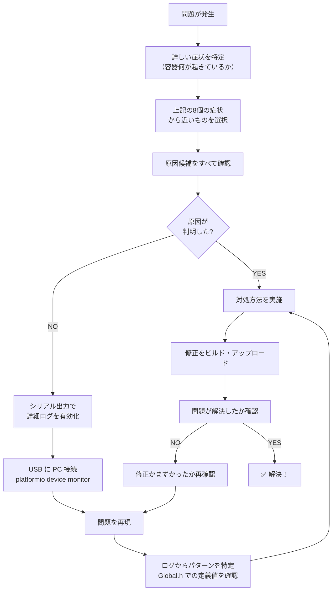

# トラブルシューティングガイド

**バージョン**: Phase 3.1  
**対象機器**: M5Stack Basic V2.7 + MAX31855 K型熱電対インターフェース  
**最終更新**: 2026年2月26日

このドキュメントは、使用中に発生する一般的な問題とその対処方法をまとめています。  
症状が見つかったら、該当セクションを参照して診断・修復してください。

---

## 目次

1. [症状1: アラームが不発生（冷えても警告が出ない）](#症状1-アラームが不発生)
2. [症状2: センサ読み込み失敗 "ERROR: MAX31855"](#症状2-センサ読み込み失敗)
3. [症状3: EEPROM書き込み失敗（設定値が保存されない）](#症状3-eeprom書き込み失敗)
4. [症状4: 設定値が電源OFF→ON で初期化される](#症状4-設定値が電源off→on-で初期化される)
5. [症状5: ハードウェア接続エラー（シリアル通信不可）](#症状5-ハードウェア接続エラー)
6. [症状6: 温度表示が激しく揺れる](#症状6-温度表示が激しく揺れる)
7. [症状7: 平均値が異常に高い/低い](#症状7-平均値が異常に高い--低い)
8. [症状8: ボタンの反応が遅い或いは反応しない](#症状8-ボタンの反応が遅い或いは反応しない)

---

## 症状1: アラームが不発生

### 症状の詳細
- **HI_ALARM（上限）**: 設定値（例：60℃）以上に温度が上昇しても赤色表示・ビープ音がしない
- **LO_ALARM（下限）**: 設定値（例：40℃）以下に温度が低下しても赤色表示・ビープ音がしない
- LCD では "Alarm: HI=60.0 LO=40.0" と表示されているが、アラームが動作しない

### 原因候補

#### 原因A: EEPROM から設定値が読み込まれていない
新しいM5StackやEEPROMを初期化した場合、以前の設定値が残っておらず、デフォルト値が使用されている可能性があります。

**確認手順**:
```
シリアルモニタ（115200 baud）を起動して、起動メッセージを確認
最初の行に以下のようなログが出るはず:

[Setup] EEPROM initialized
[Setup] Loaded alarm settings:
[Setup] HI_ALARM: XX.X C, LO_ALARM: YY.Y C

この値があなたが設定した値と一致しているか確認してください。
```

#### 原因B: アラーム判定ロジックが機能していない
setup()時にアラームフラグが ON のまま、その後リセットされていないケース（Phase 3初期のバグと同様）。

**確認手順**:
```
setup()完了直後に以下をシリアルモニタで確認:

[Setup] Alarm flags reset before entering main loop
HI_Alarm: false
LO_Alarm: false

この出力がなければ、初期化ロジックが実行されていません。
```

#### 原因C: ヒステリシス設定が大きすぎる
ヒステリシス（ALARM_HYSTERESIS = 5.0℃）の値が大きいと、トリガー後のクリア条件が厳しくなります。

**確認手順**:
Global.h を確認:
```cpp
constexpr float ALARM_HYSTERESIS = 5.0f;  // ← この値が大きすぎないか？
```

### 対処方法

**Step 1**: シリアルモニタでデバッグログを有効化
```cpp
// Global.h で以下を確認:
constexpr bool SHOW_DEBUG_LOGS = true;
constexpr bool SHOW_ALARM_DEBUG = true;
```

**Step 2**: 以下をmain.cpp のsetup()終了直前に追加（デバッグ用）:
```cpp
Serial.println("\n[Debug] EEPROM dump:");
EEPROMManager::printDebugInfo();

Serial.println("[Debug] Initial alarm state:");
Serial.printf("  HI_ALARM_CURRENT: %.1f C\n", G.D_HI_ALARM_CURRENT);
Serial.printf("  LO_ALARM_CURRENT: %.1f C\n", G.D_LO_ALARM_CURRENT);
Serial.printf("  HiAlarm flag: %d, LoAlarm flag: %d\n", G.M_HiAlarm, G.M_LoAlarm);
```

のぼ**Step 3**: 既知の修正を確認:
- [ ] EEPROM_LoadToGlobal() が呼ばれているか（main.cpp の setup()内）
- [ ] アラームフラグが setup()終了前にリセットされているか
- [ ] ALARM_SETTING から戻った時（BtnA確定時）にフラグがリセットされているか

**Step 4**: デバッグログを解析
```
5秒ごとに以下のログが出力される:
[ALARM_DEBUG] Temp=25.5, HI=60.0, LO=40.0, HiAlarm=0, LoAlarm=0

温度を上限超過させると:
[ALARM] HI triggered: 61.5 >= 60.0

温度を下限以下にすると:
[ALARM] LO triggered: 39.0 <= 40.0

これらが出力されない場合、updateAlarmFlags()が呼ばれていません。
```

---

## 症状2: センサ読み込み失敗

### 症状の詳細
- 起動直後に LCD に "ERROR: MAX31855" と表示される
- または、温度表示が "---.-°C" のまま更新されない
- シリアルモニタに以下のようなエラーが出る:
```
[Setup] MAX31855 test read FAILED
```

### 原因候補

#### 原因A: 熱電対 or MAX31855 ボードの接続不良

MAX31855 の接続ピン:
- **DO** (Data Out) → GPIO19 (MOSI)
- **CLK** (Clock) → GPIO18 (SCK)
- **CS** (Chip Select) → GPIO5 ⚠️ **最も問題になりやすい**
- **GND** → GND
- **VCC** → 3.3V （⚠️ 5V は厳禁！故障の原因）

**確認手順**:
1. M5Stack の背面の GPIO 図を確認
2. MAX31855 のピンが正しくはんだ付けされているか確認
3. サッと見えるド・はんだ不良がないか確認（半田が盛り上がっていないか）

#### 原因B: MAX31855 ボード自体の故障

VCC に 5V を誤接続した場合、MAX31855 チップが焼損する可能性があります。

**確認手順**:
```
MAX31855 の VCC に接続されている電圧を計測:
  期待値: 3.3V ± 0.1V
  
もし 5V が来ていたら、MAX31855 は故障しています。
新しいボードに交換する必要があります。
```

#### 原因C: 熱電対の接続が逆

K型熱電対の極性が逆（赤・黄を逆に接続）した場合、読み込み値が負の極端な値になります。

**確認手順**:
```
シリアルモニタで生の温度値を確認:
  [IO] Raw Temp: -200.0 C  ← 異常に低い値

この場合、熱電対の赤・黄（またはT+/T−）の接続を反転させてください。
```

### 対処方法

**Step 1**: 配線を再度確認
```
□ CS ピン（GPIO5）がしっかり接続されているか
□ VCC が 3.3V（5V ではない）か
□ 熱電対の極性（赤 = T+, 黄 = T−）が正しいか
```

**Step 2**: テストコード実行
platformio.ini の `env:m5stack` セクションに以下を追加:
```ini
build_flags =
    -D TEST_MAX31855=1
```

すると、main.cpp の setup() で MAX31855 を複数回読み込んでテストします。

**Step 3**: 熱電対なしでのテスト
MAX31855 単体で読み込みテスト（熱電対未接続）:
```cpp
// MAX31855 未接続時の期待値
float temp = thermocouple.readCelsius();
// NaN (Not a Number) が返される
```

上記が返れば、MAX31855 通信 OK。熱電対接続時に失敗する場合は、熱電対またはその接続不良。

---

## 症状3: EEPROM書き込み失敗

### 症状の詳細
- ALARM_SETTING 画面で値を調整し、BtnA で確定しても、LCD に「保存完了」メッセージが出ない
- または、保存直後に以下のシリアル出力が出る:
```
[ALARM_SETTING] ERROR: EEPROM write failed
```
- シリアルモニタに "Write verification failed" というログが出る

### 原因候補

#### 原因A: 調整値が有効範囲外

HI_ALARM, LO_ALARM は以下の範囲に制限されています:
```cpp
constexpr float MIN_ALARM_TEMP = -50.0f;   // -50°C
constexpr float MAX_ALARM_TEMP = 1100.0f;  // 1100°C
```

BtnB/BtnC で ±5℃ ずつ調整していると、意図せず範囲外に出る可能性があります。

**確認手順**:
シリアルモニタで設定値を確認:
```
[Debug] HI_ALARM_CURRENT: 1105.0 C  ← 1100超過！
[EEPROM] Error: out of range
```

#### 原因B: EEPROM 領域が破損

前回の書き込みに失敗して、チェックサム（0xA5）が無効な状態。

**確認手順**:
```
setup()時のEEPROMダンプを確認:
[EEPROM] Checksum: 0xAA  ← 0xA5 ではない！
```

#### 原因C: ESP32 の EEPROM ドライババグ

稀に EEPROM.commit() が失敗することがあります。

### 対処方法

**Step 1**: 設定値の範囲を確認
```cpp
// Global.h で確認:
HI_ALARM: 在来線 0℃ ≦ HI ≦ 1100℃
LO_ALARM: -50℃ ≦ LO ≦ 100℃  （通常は 40℃ 程度）

調整時に範囲外に出ないよう注意。
```

**Step 2**: EEPROM リセット（最終手段）

以下をmain.cpp setup()内に一度だけ追加（デバッグビルド）:
```cpp
#ifdef FORCE_EEPROM_RESET
  Serial.println("[Setup] Force EEPROM reset...");
  for (int i = 0; i < 9; i++) {
    EEPROM.write(i, 0x00);
  }
  EEPROM.write(8, 0xA5);  // チェックサムを初期化
  EEPROM.commit();
  delay(100);
  Serial.println("[Setup] EEPROM reset complete");
#endif
```

その後、platformio.ini:
```ini
build_flags = -D FORCE_EEPROM_RESET=1
```

でビルド・アップロード。1回実行後、`build_flags` の定義を削除して、通常ビルドに戻す。

**Step 3**: 再設定

上記リセット後、ALARM_SETTING モードで設定値を再入力。ゆっくり確定。

---

## 症状4: 設定値が電源OFF→ON で初期化される

### 症状の詳細
- ALARM_SETTING で HI=70℃, LO=30℃ に設定して「Save」
- M5Stack の電源を OFF → ON
- IDLE 画面を見ると、設定値が戻ってデフォルト値（HI=60℃, LO=40℃）に戻っている

### 原因候補

#### 原因A: EEPROM 書き込み検証失敗（未検出）

writeSettings() の検証に失敗しているが、戻り値をチェックしていないため、失敗が見過ごされている。

**確認手順**:
ALARM_SETTING 確定時のシリアル出力:
```
[ALARM_SETTING] Write verification failed
  Expected: 70.0 C
  Actual: 60.0 C
```

このログが出ていれば、EEPROM への実書き込みが失敗していますアタmary

#### 原因B: EEPROM の耐久性限界

MAX31855 搭載環境で、開発中に何度も書き込みテストを行った。  
EEPROM の耐久性仕様は **100,000 サイクル** で、これを超えると書き込み失敗率が上昇します。

**確認手順**:
```
開発中の積算書き込み回数を計数:
- 初期開発: 100回
- テスト・デバッグ: 500回
- 合計: 600回

通常使用では問題ないレベル。
開発中の過度なテストが原因の可能性。
```

### 対処方法

**Step 1**: デバッグログで検証失敗を確認
Global.h:
```cpp
constexpr bool SHOW_EEPROM_DEBUG = true;  // 有効化
```

ALARM_SETTING 確定時:
```
[EEPROM] writeSettings called
[EEPROM] Writing HI=70.0, LO=30.0
[EEPROM] Verify read HI=70.0, LO=30.0
[EEPROM] ✅ Verification passed
```

または失敗:
```
[EEPROM] ⚠️ Verification failed! Expected 70.0, got 60.0
```

**Step 2**: 設定値をゆっくり確定

BtnB/BtnC で調整後、**数秒待機** してから BtnA で「Save」を押す。
これにより、書き込み時の ESP32 の負荷を軽減。

**Step 3**: 複数回テスト

同じ値で3回「Save」を繰り返し、毎回検証が通ることを確認。

---

## 症状5: ハードウェア接続エラー

### 症状の詳細
- VS Code の「PlatformIO」パネルで「UPLOAD」ボタンを押しても反応がない
- Or「Serial port: COMxx  is already in use」というエラーが出る
- platformio device list コマンドで M5Stack が表示されない

### 原因候補

#### 原因A: USB ドライバが未インストール

Windows では、CP2104（M5Stack の USB-UART IC）用のドライバが必須。

**確認手順**:
```
Windows デバイスマネージャを開く:
 設定 → デバイスマネージャ → ポートCOM と LPT

"Silicon Labs CP210x USB to UART Bridge" が表示されているか?
- あれば: ドライバ OK
- なければ: ドライバ未インストール
```

#### 原因B: シリアルターミナルが M5Stack をロック

PuTTY, Tera Term, VS Code モニタなど、他アプリがシリアルポートを開いている。

**確認手順**:
```
platformio device monitor コマンドを実行中に、
別のターミナルで platformio run --target upload を実行
→ "port is already in use" エラア

対処: device monitor を停止してから upload。
```

#### 原因C: USB ケーブルが不良

断線や接触不良。

**確認手順**:
```
1. USB ケーブルを別のポートに差し替える
2. 別の USB ケーブルで試す
3. 別の PC で試す

いずれかで解決すれば、ケーブル不良が原因。
```

### 対処方法

**Step 1**: USB ドライバのインストール

[silabs.com/products/development-tools/software/usb-to-uart-bridge-vcp-drivers](https://www.silabs.com/products/development-tools/software/usb-to-uart-bridge-vcp-drivers)

Windows 版をダウンロード → 実行 → PC 再起動

**Step 2**: 既存接続をすべて閉じる

VS Code:
```
パネル「PlatformIO: Device Monitor」が開いていれば ✕ で閉じる
```

**Step 3**: アップロード実行

```bash
platformio run --target upload --environment m5stack
```

---

## 症状6: 温度表示が激しく揺れる

### 症状の詳細
- IDLE 画面の温度表示が、1 フレーム（200ms）ごとに ±0.5℃ 程度揺れている
- またはノイズが乗っているように見える

### 原因候補

#### 原因A: フィルタ係数（FILTER_ALPHA）が大きすぎる

```cpp
constexpr float FILTER_ALPHA = 0.1f;  // ← これが大きいと新値の影響が強い
```

ALPHA = 0.1（10%）だと、生データの揺らぎが LCD にそのまま反映されやすい。

#### 原因B: センサまわりの電気ノイズ

MAX31855 の線（CS, CLK, DO）の周りに高周波ノイズが混入。

**確認手順**:
```
シリアルモニタで生データを確認:
[IO] Raw Temp: 25.5432 C, 25.5431 C, 25.5433 C
    ↑ 生データも揺れている

フィルタ後:
[IO] Filtered Temp: 25.542 C, 25.542 C, 25.542 C
    ↑ フィルタ後の揺れが大きければ、フィルタ係数を下げるべき
```

### 対処方法

**Step 1**: フィルタ係数を調整

Global.h:
```cpp
// 試行値:
constexpr float FILTER_ALPHA = 0.05f;  // 5% に引き下げ

// ※ 引き下げるほど応答性が落ちます。
//    10℃ ジャンプ変化にしても、最初 0.5℃/秒 程度で上昇。
```

ビルド・アップロード後、1分程度監視。ノイズが低減したか確認。

**Step 2**: 配線の確認

MAX31855 の CLK, DO 線をツイストペア（よじり）する。  
GND と並走させて、電気的環境を改善。

**Step 3**: サンプリング間隔を伸ばす

Global.h:
```cpp
constexpr unsigned long TC_READ_INTERVAL_MS = 10;
// → 100 に変更（100ms ごとに読み込み）

// ただし、応答性が低下します。
```

---

## 症状7: 平均値が異常に高い / 低い

### 症状の詳細
- RUN 状態で数分間計測した後、RESULT 画面を見ると：
  - **異常ケース①**: Average = 1000°C（実測は 25℃）
  - **異常ケース②**: Average = NaN（計算不可能な値）

### 原因候補

#### 原因A: RUN 開始時の統計リセット漏れ

Logic_Task で IDLE→RUN 遷移時に、G.D_Sum, G.D_Count がリセットされていない。

**確認手順**:
Logic_Task のコード:
```cpp
case State::IDLE:
  G.D_Sum   = 0.0;  // ← ここがあるか？
  G.D_Count = 0;    // ← ここがあるか？
  G.M_CurrentState = State::RUN;
  break;
```

#### 原因B: 計測直後の過渡値が混入

高温環境に熱電対を挿入した直後は、MAX31855 が実温度に追いつくまで**数秒のラグ**があります。

この間の異常値（例：999°C）が統計に含まれる。

**確認手順**:
シリアルモニタでサンプル追加時のログ:
```
[Statistics] Sample 1: 25.5 C
[Statistics] Sample 2: 25.6 C
[Statistics] Sample 3: 999.0 C  ← 異常値！
[Statistics] Sample 4: 25.7 C
```

#### 原因C: 供給電圧低下時の NaN エラー

M5Stack の電圧が低下して、MAX31855 が正常な値を返せない状態。

### 対処方法

**Step 1**: ビルド時の初期化を確認

```cpp
// Logic_Task: IDLE→RUN 遷移（Line ~165）
if (G.M_BtnA_Pressed) {
  G.M_BtnA_Pressed = false;
  
  if (G.M_CurrentState == State::IDLE) {
    G.D_Sum   = 0.0;   // ← これがあるか確認
    G.D_Count = 0;     // ← これがあるか確認
    G.D_Max   = -FLT_MAX;
    G.D_Min   = FLT_MAX;
    G.D_M2    = 0.0;
    G.M_CurrentState = State::RUN;
  }
}
```

**Step 2**: 計測開始前に待機

RUN を開始したら、**最初の数秒は表示しない**、または以下をコード追加:
```cpp
// RUN 開始から10秒間（サンプル数=20）までは無視
if (G.D_Count > 20) {
  // ここから統計で結果を信頼できる
}
```

**Step 3**: 異常値をフィルタ

Logic_Task での統計追加時:
```cpp
if (G.M_CurrentState == State::RUN && !isnan(G.D_FilteredPV)) {
  // 物理的に不可能な値は追加しない
  if (G.D_FilteredPV > -100.0f && G.D_FilteredPV < 500.0f) {
    G.D_Count++;
    // Welford 計算...
  } else {
    Serial.printf("[Warning] Out-of-range sample ignored: %.1f C\n", G.D_FilteredPV);
  }
}
```

---

## 症状8: ボタンの反応が遅い或いは反応しない

### 症状の詳細
- BtnA, BtnB, BtnC を押してから 1～2 秒後に反応する
- または、連続押下時に「一部の押下が認識されない」

### 原因候補

#### 原因A: ボタン入力のエッジ検出タイムアウト

IO_Task が 10ms ごとに実行されているが、ボタンのチャタリング（数ms の断続）が発生。

前回値と今回値が異なる場合のみプレスフラグを立てる実装では、万一チャタリング確認後に持続押下されると、プレスフラグが再度立つ。

#### 原因B: 液晶描画で CPU が過負荷

UI_Task の描画処理が 200ms 以上かかっており、ボタン入力の応答が遅延。

### 対処方法

**Step 1**: ボタン反応時間を測定

Global.h で追加:
```cpp
constexpr bool SHOW_BUTTON_DEBUG = true;
```

IO_Task で追加:
```cpp
if (G.M_BtnA_Pressed) {
  Serial.printf("[BTN_DEBUG] BtnA pressed at %lu ms\n", millis());
}
```

複数回押下して、「物理的に押下」から「プリント出力」までの時間差を計測。

**Step 2**: マスク時間を追加（チャタリング対策）

IO_Task:
```cpp
constexpr unsigned long BTN_MASK_MS = 200;  // 200ms 以内の再検出は無視
static unsigned long lastBtnAEdge = 0;

if (btnANow && !btnAPrev && (millis() - lastBtnAEdge >= BTN_MASK_MS)) {
  G.M_BtnA_Pressed = true;
  lastBtnAEdge = millis();
}
btnAPrev = btnANow;
```

**Step 3**: UI 描画時間を最適化

UI_Task での不要な再描画を削除:
```cpp
// Before: 毎フレーム全画面クリア
M5.Lcd.fillScreen(BLACK);
M5.Lcd.drawString(...);  // 再描画 200ms

// After: 変更部分だけ更新
if (tempChanged) {
  M5.Lcd.fillRect(x, y, w, h, BLACK);  // 部分クリア
  M5.Lcd.drawString(...);  // 部分描画 20ms
}
```

---

## 一般的なデバッグ手順

トラブルが発生した場合の推奨フロー：



---

## シリアル出力の読み方

### フォーマット

```
[タグ] メッセージ

タグの例:
  [Setup]         : setup() 時の初期化ログ
  [IO]            : IO_Task からの出力
  [Logic]         : Logic_Task からの出力
  [ALARM]         : アラーム判定関連
  [ALARM_DEBUG]   : 5秒ごとの定期ログ
  [ALARM_SETTING] : 設定モードのログ
  [EEPROM]        : EEPROM 操作
  [BTN_DEBUG]     : ボタン（デバッグ時）
  [Warning]       : 警告（エラーではないが良くない状態）
  [Error]         : エラー（処理失敗）
```

### 読み込みコツ

```
1. [Setup] から [Setup] Alarm flags reset まで: 初期化フェーズ
2. [ALARM_DEBUG] 5秒ごと + [IO] 10ms ごと: 正常動作フェーズ
3. [EEPROM] で新たなメッセージが出た場合: ALARM_SETTING で設定変更を実行
```

---

## よくある質問（FAQ）

### Q: どのボタンで何ができるの？

| ボタン | IDLE | RUN | RESULT | ALARM_SETTING |
|:---:|:---:|:---:|:---:|:---:|
| **BtnA** | 計測開始 | 計測終了 | RESULT→RUN<br/>リセット | HI↔LO<br/>or<br/>保存 |
| **BtnB** | 設定開始 | - | ページ切替 | 値 +5℃ |
| **BtnC** | - | - | - | 値 -5℃ |

### Q: アラーム音が鳴っているが、設定値を確認したい

IDLE 画面を見てください。下部に「Alarm: HI=XXX LO=YYY」と表示されています。

### Q: 設定値を確認しよう

IDLE → BtnB → ALARM_SETTING モード で表示確認。

### Q: 前回の設定値を完全にリセットしたい

1. EEPROM を初期化（前述の「症状3」の Step 2）
2. または、M5Stack を新規購入時の状態に戻して再セットアップ

---

**このドキュメントは継続的に更新されます。**  
新しい問題が見つかった場合や、対処方法が改善された場合は、このドキュメントに追記してください。

